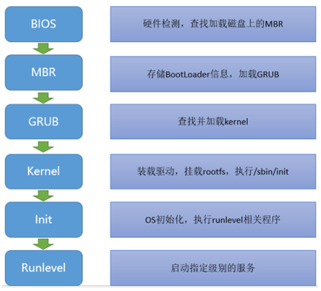

### 系统开机流程 ###

### 运行级别 ###
- Linux系统有7个运行级别(runlevel)
	- 运行级别0：系统停机状态，系统默认运行级别不能设为0，否则不能正常启动
	- 运行级别1：单用户工作状态，root权限，用于系统维护，禁止远程登陆
	- 运行级别2：多用户状态(没有NFS)
	- 运行级别3：完全的多用户状态(有NFS)，登陆后进入控制台命令行模式
	- 运行级别4：系统未使用，保留
	- 运行级别5：X11控制台，登陆后进入图形GUI模式
	- 运行级别6：系统正常关闭并重启，默认运行级别不能设为6，否则不能正常启动

			Linux系统有7个运行级别(runlevel)
			0：关机模式
			1：单一用户模式(直接以管理员身份进入)
			2：多用户模式（无网络）
			3：多用户模式（命令行）
			4：保留
			5：多用户模式（图形界面）
			6：重启

			在不同的运行级别下，/etc/rc.d/rc这个脚本会分别执行不同目录下的脚本
			Run level 0 – /etc/rc.d/rc0.d/
			Run level 1 – /etc/rc.d/rc1.d/
			Run level 2 – /etc/rc.d/rc2.d/
			Run level 3 – /etc/rc.d/rc3.d/
			Run level 4 – /etc/rc.d/rc4.d/
			Run level 5 – /etc/rc.d/rc5.d/
			Run level 6 – /etc/rc.d/rc6.d/
			　　这些目录下的脚本只有K*和S*开头的文件，K开头的文件为开机需要执行关闭的服务，S开头的文件为开机需要执行开启的服务。

- 运行级别的原理
	1. 在目录/etc/rc.d/init.d下有许多服务器脚本程序，一般称为服务(service)。
	2. 在/etc/rc.d下有7个名为rcN.d的目录，对应系统的7个运行级别。
	3. rcN.d目录下都是一些符号链接文件，这些链接文件都指向init.d目录下的service脚本文件，命名规则为K+nn+服务名或S+nn+服务名，其中nn为两位数字。
	4. 系统会根据指定的运行级别进入对应的rcN.d目录，并按照文件名顺序检索目录下的链接文件
		1. 对于以K开头的文件，系统将终止对应的服务
		2. 对于以S开头的文件，系统将启动对应的服务
	5. 查看运行级别用：runlevel
	6. 进入其它运行级别用：init N
	7. 另外init 0为关机，init 6为重启系统

由于现在的Linux系统安装完后就运行在第5个级别，即系统启动后直接进入图形界面，而不用在字符模式下登录后用startx或者xinit 来起动图形界面。建议在系统安装完成后把系统的默认运行等级设置在第3级，在字符终端登录后，再手工输入startx 命令起动图形界面。

- 可以用如下的方法修改
	- 用文本编辑器修改 /etc/inittab文件，把代码:
	- id:5:initdefault:这一行，修改成代码:
	- id:3:initdefault:保存后就reboot重起，系统就默认起动到字符界面。
	- CentOS 7 修改方式：
		- systemctl get-default   //查看启动方式
		- systemctl set-default multi-user.target   //设置多用户命令模式
		- reboot.即进入命令模式。

不同运行级别之间的 差别的在于系统默认起动的服务的不同，如运行级别3默认不启动X图形界面服务，而运行级别5 却默认起动。本质上是没有区别的，更无所谓不同级别间功能强弱的问题。用户完全可自给定义不同级别的默认服务。在任何运行级别，用户都可用init 命令来切换到其他运行级别。

- Linux系统引导流程
	1. 开机自检
	2. MBR引导
	3. GRUB
	4. 加载linux内核和image映像
	5. INIT进程初始化

- 流程简介
	1. 加载 BIOS 的硬件信息、进行自我测试,并依据设定获得第一个可开机的设备;
	2. 读取并执行第一个开机设备内 MBR 的 boot Loader(grub 等程序);
	3. 依据 boot loader 的设置加载 Kernel,Kernel 会开始检测硬件与加载驱动程序;
	4. 内核启动 init;
	5. 系统初始化:(/etc/init/rcS.conf exec /etc/rc.d/rc.sysinit);
	6. init 找到/etc/inittab 文件,确定默认的运行级别(X) (/etc/init/rcS.conf exec telinit $runlevel);
	7. 触发相应的 runlevel 事件(/etc/init/rc.conf exec /etc/rc.d/rc $RUNLEVEL);
	8. 开始运行/etc/rc.d/rc,传入参数 X;
	9. /etc/rc.d/rc 脚本进行一系列设置,最后运行相应的/etc/rcX.d/中的脚本;
	10. /etc/rcX.d/中的脚本按事先设定的优先级依次启动;
	11. 最后执行/etc/rc.d/rc.local;
	12. 加载终端或 X-Window 接口。
