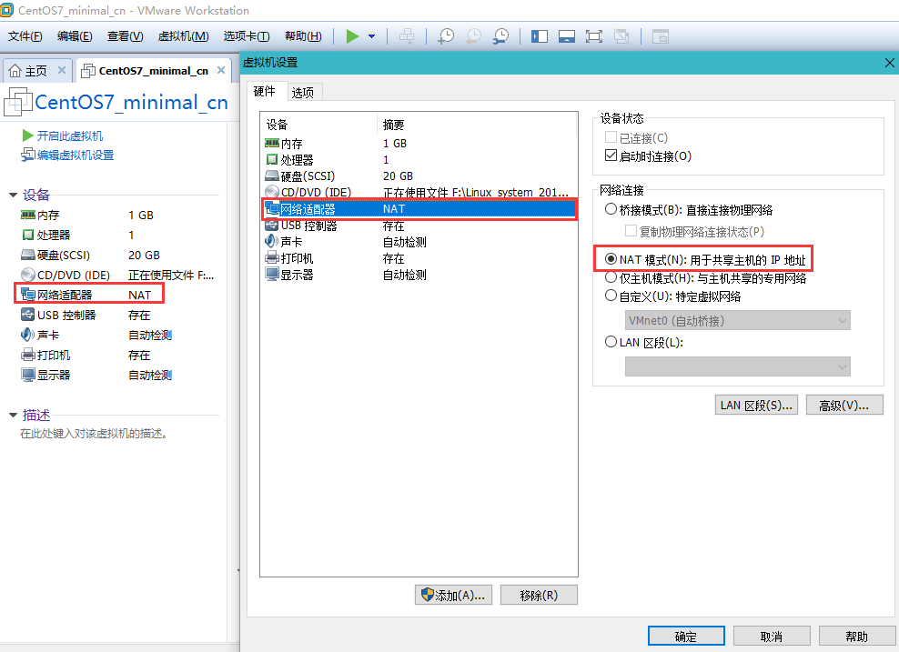
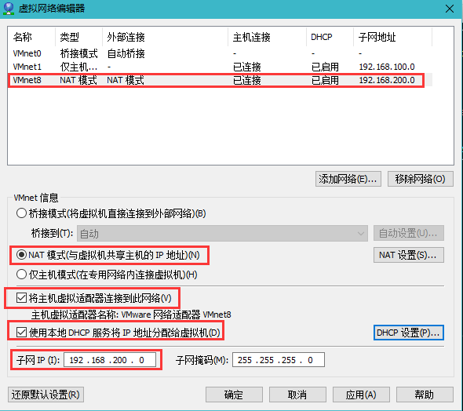
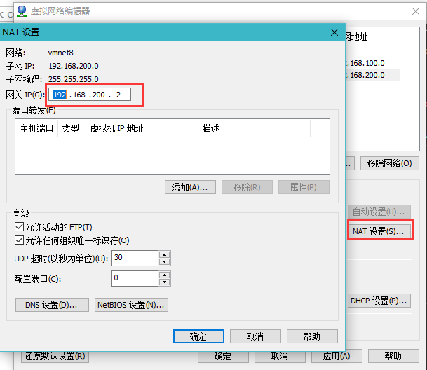
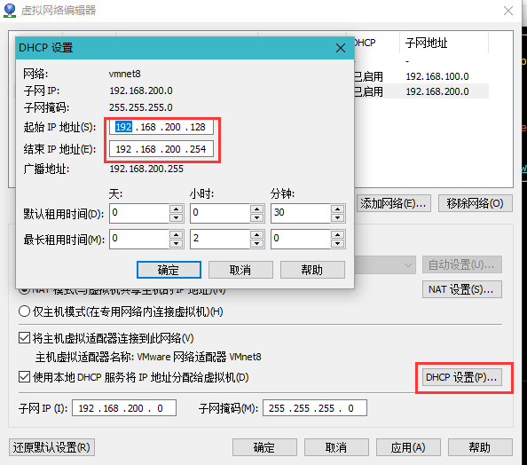

### 网络安全: NAT ###

公有IP地址：也叫全局地址，是指合法的IP地址，它是由NIC（网络信息中心）或者ISP(网络服务提供商)分配的地址，对外代表一个或多个内部局部地址，是全球统一的可寻址的地址。

私有IP地址：也叫内部地址，属于非注册地址，专门为组织机构内部使用。

因特网分配编号委员会，保留了3块IP地址做为私有IP地址：

	10.0.0.0 ——— 10.255.255.255
	172.16.0.0——— 172.31.255.255
	192.168.0.0———192.168.255.255

地址池：由外部地址（全球唯一的IP地址）组合。

NAT英文全称是“Network Address Translation”，中文意思是“网络地址转换”，允许一个整体机构以一个公用IP地址出现在Internet上。顾名思义，它是一种把内部私有网络地址，翻译成合法网络IP地址的技术。因此可认为，NAT在一定程度上，能够有效的解决公网地址不足的问题。

### vmware centos7配置虚拟机NAT连接上网 ###
1. 关闭虚拟机中的Linux系统。
2. 配置设备中的网络适配器为NAT。

3. 菜单中，编辑-》虚拟网络编辑器的VMnet8，处于NAT模式，并启动DHCP服务，主机处于连接状态。点击“还原默认配置”，配置下面的NAT模式勾选“将主机虚拟适配器连接到此网络”和“使用本地DHCP服务将IP地址分配给虚拟机”。

4. NAT设置里面的网关配置为“192.168.200.2/24”。

5. DHCP设置里面的网关配置为“192.168.200.128-254/24”

6. 配置完成后，点击“应用”。

[参阅资料](https://blog.csdn.net/qq_17011423/article/details/82947417)
